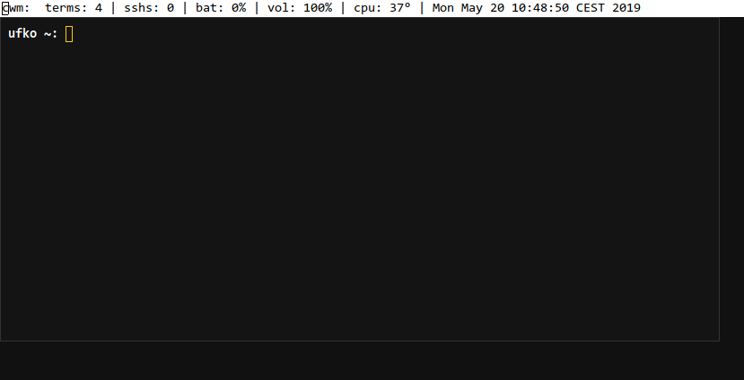

**If you like Termbar idea** please share your scripts with me via pull
requests, pastebins, issues ...  Thanks.

This idea came from assumption that you are using some kind of panel or
bar in your WM and that many window managers **are able to**:

* create a gap between screen edge and window border
* ignore particular window
* show particular window on all workspaces (sticky windows)

To replace all those conkys, bars, panels you need only:

* terminal window
* shell script or any other language

On the following image is Termbar (xterm) showing some info useful for
me e.g number of ssh sessions running.  It is very simple example, the
possibilities are endless, you can output anything into Termbar.

Termbar window is ignored by cwm(1), it is ignored while switching
between windows, it has no border, it is not covered by other windows if
you maximize them.

[View raw image](https://raw.githubusercontent.com/vetelko/termbar/master/screenshot.png)

